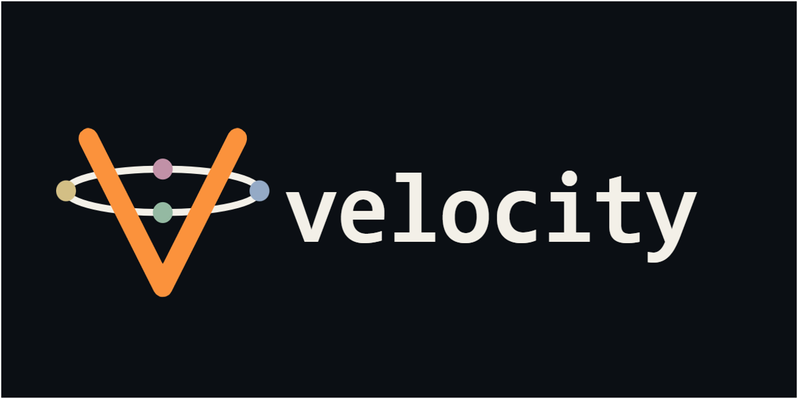

# Velocity — Project Docs

This is the documentation for **Velocity**, a personal dashboard built by a small team of collaborators:

- **Velocity** — the inspiration
- **Gary** — the old man with a plan
- **Kyle** — the next generation of thought
- **Corey** — the think partner, builder, and friend
- **Carla** — the eye candy confectioner

Velocity is a card-based web dashboard — you add cards to a canvas, each card pulls in live data or runs AI features. Cards can show things like sports scores, YouTube feeds, collectibles tracking, and AI-powered debate tools.

The project is private, but these docs are here so you can follow along with what's being built and how it's put together.

## What's Here

- [velocity-stack.md](velocity-stack.md) — the full tech stack: every library, framework, and service the project uses

## More Coming

More docs will be added here as the project grows — architecture notes, feature write-ups, and session logs.
